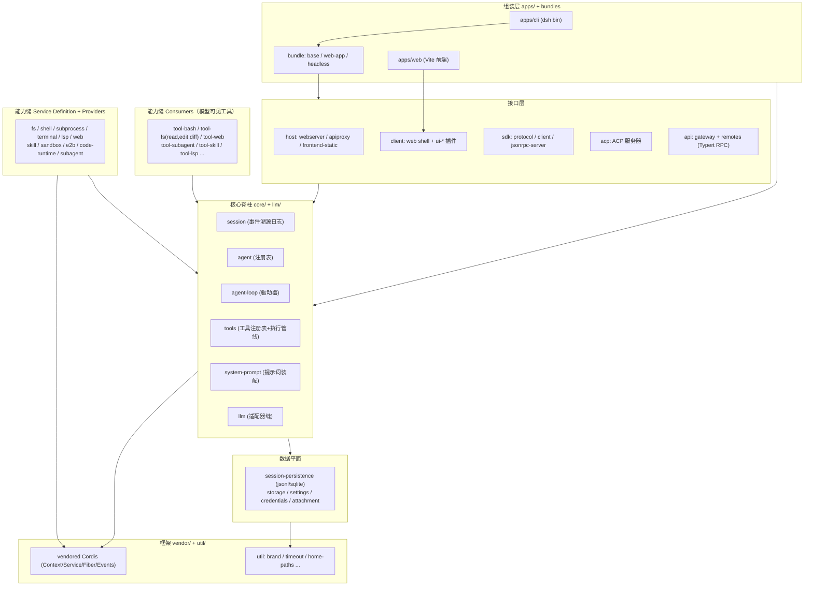
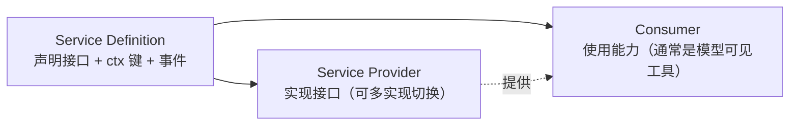

# 02 整体架构

> 依据：`docs/architecture.md`、`docs/cordis-primer.md`、`AGENTS.md` 及源码分析。

## 1. 分层总览



运行中的 `dsh` = 启动时按层序组合出的**插件树**。没有编译期特权核心：扩展 dsh 的方式是把插件挂到其他插件旁边，注册随插件卸载自动回滚。

## 2. Cordis 编程模型（最小必读）

- **Context**：插件间共享的服务容器与事件总线。服务通过声明合并 (declaration merging) 挂到 `ctx.<key>`（如 `ctx.sessions`、`ctx.tools`、`ctx.llm`）。
- **注册即效果**：所有贡献走 `ctx.effect()` / `ctx.on()` / `ctx.waterfall()`；`register()` 返回 disposer，插件 (Fiber) 卸载时全部回滚——HMR 安全。
- **事件五种分发模式**：`emit`（忽略返回值）、`parallel`（await 全部）、`serial`（顺序执行、bail 即停）、`bail`（首个非空返回值短路）、`waterfall`（中间件链，**监听器必须调用 `next()` 委托**，不调用即短路整条链）。
- **作用域**：`ctx.extend()` / `ctx.isolate()` / `ctx.intercept()` 提供上下文隔离与配置拦截；dsh 在其上用 `dsh-scope` 实现 per-agent 作用域（见 [03-核心包详解](03-核心包详解.md#scope)）。

## 3. Profile 与 Bundle：运行时如何组装

一次运行 = 一个命名 **profile**（存于 Harness home，如 `~/.deepseek-harness/`）按顺序叠加多个层：

1. profile 的 `dsh.profile.bundles` 列出的各 **bundle**（按列出顺序）
2. profile 自身 `cordis.patch.yml`
3. home 级 `cordis.patch.yml`
4. 命令行 `--patch` overlay（可多个）

**bundle** 是 Cordis 配置行 + 其挂载代码的发行格式（`package.json` 的 `dsh.bundle` 字段指向 patch 文件）；profile 通过 `dsh.profile` 字段声明 bundle 栈。patch 按 id 定位配置行，可整行替换或插入新行。

| Bundle | 内容 |
|---|---|
| `dsh-base`（每个 profile 的第一层） | 模型适配器、工具、持久化、沙箱与审批策略、settings、credentials、遥测 |
| `dsh-web-app` | 追加浏览器应用（web server + 前端） |
| `dsh-headless` | 追加一次性 runner，完全无 server |

`web` 和 `headless` 作为模板随产品发行。查看实际启动树：

```sh
dsh --profile web --dump-config
```

机制实现见 `packages/boot/app-boot`（详见 [06-应用与接口层](06-应用与接口层.md)）。

## 4. Turn 流程（Agent 循环核心时序）

术语：**step** = 一次模型请求 + 其调用的工具；**turn** = 0 或多个 step，从首个输入被认领前开启，到不再欠任何东西时关闭。

```text
turn/start
  认领 next-step 输入 + 一条排队消息
  装配 prompt sections + tool schemas
  -> agent/pre-step                reject | enter(messages)   [waterfall]
     （reject 或首次 enter 被改写为空 -> 无 step 地关闭 turn，日志仍记录该尝试）
     step/start
     认领消息落日志为 user/message
     deriveMessages() 从日志导出模型历史
     agent/request -> llm/stream -> assistant/chunk* -> assistant/message
     tool/call* -> tools/pre-execute -> tools/execute -> tools/post-execute -> tool/result*
     step/end
     （工具还欠请求，或 next-step 输入到达 -> 认领 -> 下一个 step）
  -> agent/turn-stopping                                   [serial，无 next()]
turn/end
```

要点：

- `turn/*`、`step/*`、`user/message`、`assistant/*`、`tool/*` 是**持久 session 事件**；其余是跨三个域的**活扩展点**。
- `agent/pre-step`、`agent/request`、`llm/stream`、三个 `tools/*` 是 waterfall（必须 `next()`）；`agent/turn-stopping` 是 serial 且无 `next()`。
- 输入经**单一 inbox** 到达驱动器：`followup`（新 turn）/ `steer`（最近 step）/ `inject`（不唤醒的模型可见上下文）。部分消息立即唤醒，注入上下文则等待下一条唤醒消息。

## 5. 事件体系（扩展点选型）

| 域 | 用途 | 机制 |
|---|---|---|
| Session 事件（`session/event` 广播） | 必须在重载后存续的持久事实（`SessionEventMap`） | 只追加日志；类型化事件用声明合并扩展；读取时默认"必须已知类型"，除非事件带 `ignorable: true` |
| Agent 事件（`agent/*`） | 观察或拦截进行中的工作：inbox、step、status、request、validation、continuation | 携带活 `Agent`；`dsh-scope` 做 agent 级过滤分发 |
| 能力事件（`fs/*`、`tools/*`、`telemetry/*` 等） | 给能力缝挂策略/适配器，无需 import 循环 | 各 Service Definition 声明 |

## 6. Session Log：模型上下文的唯一来源

- 会话日志是模型所见上下文的**源头**：`deriveMessages()` 从日志投影模型历史；原始 `assistant/chunk` 事件保留以支持回放与 UI 保真。
- Fork、resume、transcript、遥测、持久化全部从该事件流派生。
- **运行时不变量强制"模型可见 ⟺ 已记录"**：新增模型可见输入 ⇒ 必须新增 session 事件类型并从日志渲染。
- 会话格式版本 `SESSION_FORMAT_VERSION = 0`（预发布期无兼容承诺）；SQLite 持久化用单调 `SCHEMA_VERSION`。

## 7. 能力缝 (Capability Seam)

一个**缝** = 可替换能力，固定三角色：



- 包可合并角色，但**只有一个角色不构成缝**；新增能力必须设计齐三角色。
- 缝是"换一个 provider 改变整个产品"的原因：fs 与 subprocess 共享一个执行世界，把它们指向远程沙箱后，Bash、PTY、LSP 随之迁移，无 provider 分叉。
- Subagent provider 展示了缝的宽度：从进程内子 agent 到委派给另一个产品的 turn，七种实现共用一个接口（见 [04-能力包详解](04-能力包详解.md#subagent)）。

## 8. 新行为放哪里（扩展点地图）

| 目标 | 机制 |
|---|---|
| 新增模型供应商 | 在 `ctx.llm` 注册 adapter |
| 新增模型可见能力 | 在 `ctx.tools` 注册；其 schema 自动加入提示词装配 |
| 给某会话不同能力集 | 组合 agent preset；其中的 service 行需 `isolate` realm |
| 新增 shell 执行 | 注册 `ctx.shell` backend；本地实现经 `ctx.subprocess` 派生 |
| 新增持久终端 | 注册 `ctx.terminals` backend + `dsh-tool-terminal` |
| 新增人类命令 | 注册 `ctx.commands`；不经模型 turn 分发 |
| 新增后台工作 | 注册 `ctx.jobs`；`job_*` 工具收集/停止 |
| 新增文件系统访问/策略 | 注册 `ctx.fs` provider 或监听 `fs/*` 事件 |
| 限制派生进程 | 使用 `ctx.sandbox` backend；消费者在 spawn 前包装 argv |
| 拦截请求/工具/turn | 用对应 `agent/*` / `tools/*` 事件；`agent/turn-stopping` 可停 turn |
| 注入模型可见上下文 | `agent.inject()`；落入下一个被接纳的请求 |
| 新增 UI / 编辑器集成 | 驱动 `ctx.agents` 并从 `session/event` 渲染 |
| 新增 Web 会话节点 | 注册 `ConversationNodeDefinition` + keyed renderer |
| 新增持久会话状态 | 扩展 `SessionEventMap`；从日志渲染与回放 |
| 生成会话标题 | 注册唯一的 `ctx.sessionTitle` provider |
| 管理同会话目标 | 用 `ctx.goals`；经 `agent/*` 续跑 |
| Fork 活会话 | `ctx.sessions.fork(source, boundary?, childSessionId?)` |
| 把注册限定到一个 agent | 用该 agent 的 `agent.ctx` |

## 9. 源码面 vs 产物面（TypeScript 布局要点）

- 仓库维护两个隔离聚合程序：`tsconfig.host.json`（Node 侧）与 `tsconfig.client.json`（浏览器侧），因为两侧用同名键对 `Context` 做不同的声明合并，同处一个 Program 会类型冲突。
- 根 `tsconfig.json` 只是 solution 引用两者；`tsconfig.base.json` 是共享 paths 门面（永不加 `include`）。
- 唯一例外是 `packages/api/remotes`（Host/Client 双 face，因 Typert 生成契约的构建顺序）。
- 构建顺序：`tsc -b host` → `tsdown host`（Typert 在此运行）→ `tsc -b client` → `tsdown client` → `build:web`。
- 静态检查/测试经 paths 直接解析到 `src`，干净树上必须通过；消费 `lib/` 产物的门禁显式声明该依赖。
