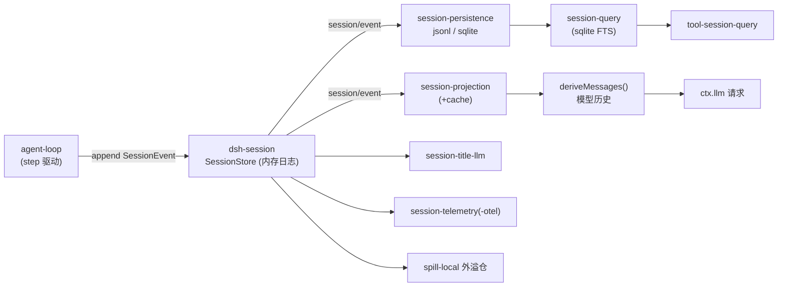

# 05 会话与数据平面

> 会话持久化/投影/标题/遥测、会话检索、存储、设置、凭据、身份、附件、工作区、外溢存储。核心原则：**Session 日志是唯一真源**，本层全部是其派生或旁路数据面。

## 1. session/ — 持久会话数据面

| 包 | 职责 |
|---|---|
| `session-persistence` | 持久化缝（Service Definition）：订阅 `session/event`、在 `session/flush` 落盘；branded id 与 timeout 预算 |
| `session-persistence-jsonl` | JSONL 后端（Windows 上用 koffi 调 MoveFileExW 实现 write-through 发布，见 pnpm `allowBuilds` 注释） |
| `session-persistence-sqlite` | SQLite 后端（单调 `SCHEMA_VERSION`，拒绝旧磁盘格式——预发布期策略） |
| `session-projection` | 投影缝：从事件流构建读模型 |
| `session-projection-cache` | 投影缓存（组合 storage-domain） |
| `session-checkpoint-policy` | 会话检查点策略（经 agent/llm/tools 事件） |
| `session-title` | 标题缝（`ctx.sessionTitle`，唯一 provider 模式） |
| `session-title-llm` + `session-title-first-prompts-llm` / `session-title-all-prompts-llm` | 两种 LLM 标题生成策略（首条提示 vs 全部提示） |
| `session-stats` | 会话统计（token/轮次等，喂 UI） |
| `session-telemetry` / `session-telemetry-otel` | 遥测缝 + OpenTelemetry 导出（组合匿名身份与命令反馈） |

## 2. session-query/ — 会话检索族

| 包 | 职责 |
|---|---|
| `session-query` | 逻辑语料、有界读取、谱系（fork/parent 关系）、事件关系、语义过滤 |
| `session-query-sqlite` | SQLite 全文检索后端 |
| `tool-session-query` | `session_query` 模型工具（跨会话记忆检索） |
| `session-log-export` | 会话日志导出（client 侧命令） |

## 3. storage/ — 非会话存储

| 包 | 职责 |
|---|---|
| `storage` | 存储枢纽（Service Definition，`ctx.storage`） |
| `storage-json` / `storage-sqlite` | JSON 文件 / SQLite 后端 |
| `storage-domain` | 领域表单（消息反馈、投影缓存等使用） |

## 4. settings / credentials / identity / attachment / workspace

| 包 | 职责 |
|---|---|
| `settings/settings` | 用户设置缝（`ctx.settings`，schema 驱动；设置区段经 `installSettingsSection` / `settingsNamespace` 注册，见 agent-loop 用法） |
| `settings/settings-file` | 文件后端（atomic-write 原子写入 home-paths 路径） |
| `credentials/credentials` | 凭据引用缝（引用而非明文；`ctx.credentials`） |
| `credentials/credentials-local` | env 优先于 `.env` 的本地 provider |
| `identity/anonymous-user-id` | 匿名身份（本地生成持久化，喂遥测/llm-deepseek 归因） |
| `attachment/attachment` | 持久附件身份/校验缝 |
| `attachment/attachment-local` | 本地内容寻址存储 |
| `workspace/workspace` | 工作区实体（组合 session-persistence 与 storage-domain） |

## 5. spill/ — 结果外溢

超大工具结果不进上下文而是外溢到本地存储，模型收到预览 + 定位器：

- `spill`（Service Definition）→ `spill-local`（本地存储实现）→ `spill-policy`（Consumer：在 tools 管线与 `tools/code-dispatch-log` 处替换超大文本为 preview+locator）。
- 与 `util/output-retention`（输出保留预算）配合。

## 6. 数据流总览

## 7. 模型可见性的边界

- 凡进入模型请求的内容必须可从日志重建（运行时不变量断言），因此本层所有"喂给模型"的数据（标题、检索结果、外溢定位器）最终都经 session 事件或工具结果落日志。
- 凭据永不进入日志/错误消息：`assertUsableApiKey` 的诊断只指名引用位置。
