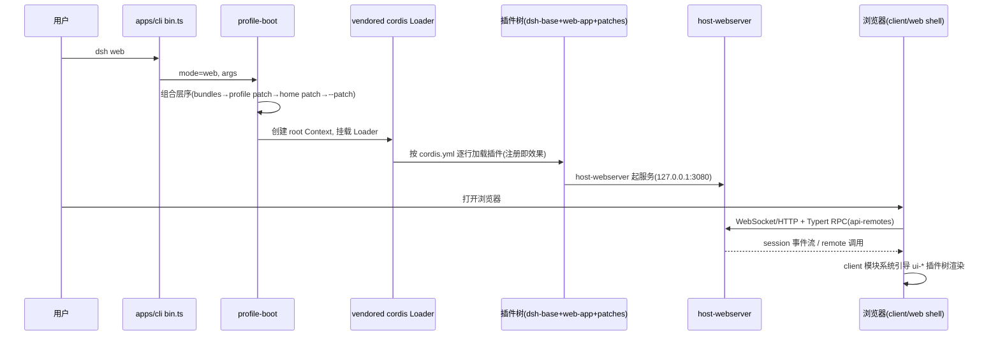

# 06 应用与接口层

> CLI、Web 前端、启动 glue、Profile/Bundle 组合层、宿主/浏览器 halves、Typert RPC、SDK、ACP。

## 1. apps/cli — `dsh` 命令行

入口 `apps/cli/src/bin.ts`：解析参数后按 mode 动态分发到三个模块。

| 文件 | 职责 |
|---|---|
| `src/args.ts` | `parseDshArgs`：解析 `--profile`、`--patch`、`--dump-config`、`--dump-default-config`；定义 `dsh web` 别名与 `dsh plugin` 子命令，剩余参数透传 |
| `src/profile-boot.ts` | Profile 启动核心：按序组装 `dsh.profile.bundles` → profile `cordis.patch.yml` → home 级 patch → `--patch` overlays → agent-presets → 遥测 patch，然后经 Cordis Loader 引导插件树 |
| `src/plugin.ts` | 插件管理：调 pnpm 安装/移除，检查依赖声明的 `dsh.bundle.patch`，同步更新 profile 的 `dsh.profile.bundles` |
| `src/dump-config.ts` | `--dump-config`：不启动，只把各层 patch 渲染为可读配置树输出 |
| `reference/README.md` | CLI 行为参考（patch 组合顺序、web/headless 初始化、参数传递、dump 语义） |

常用调用：

```sh
dsh web                                  # = --profile web，启动 Web UI（默认 127.0.0.1:3080）
dsh --profile headless "task"            # 一次性任务
dsh --profile web --dump-config          # 打印实际启动树
dsh plugin --profile web add <pkg>       # 安装第三方 bundle 并入栈
```

源码启动契约：根 `package.json` 的 `"dsh": "node --import tsx/esm apps/cli/src/bin.ts"`——tsx 的 ESM-only hook；其触达的模块必须保持 ESM（无 CJS-only 导出）。

## 2. apps/web — Web 前端

- `src/main.ts`：创建并运行 `AppWebEntry`——只是 `packages/client/web` shell 库的 thin bootstrap。
- 构建：Vite 6（`vite.config.ts` 将 `@deepseek-ai/dsh-client-web` 等映射到 `packages/client/*/src`，manualChunks 分包）；产物 `dist/` 由 `dsh web` 的宿主静态服务。
- 技术栈：React 18 + react-dom；测试 Playwright + Vitest browser（`tests/*.e2e.ts`：goal-bar、hmr-live、steering 等）。

## 3. boot/ — 共享启动 glue

| 包 | 职责 |
|---|---|
| `boot/app-boot` | profile/bundle 组合机制核心：层序应用（见 [02 §3](02-整体架构.md#3-profile-与-bundleruntime-如何组装)）、env 加载、Loader 守卫、配置解析、启动序列、launcher→app 命令行交接 |
| `boot/cmdline` | 命令行工具 |

## 4. bundle/ + preset/ — 组合层

| 包 | 职责 |
|---|---|
| `bundle/base`（`dsh-base`） | 每个 profile 的第一层：模型适配器、工具、持久化、沙箱与审批策略、settings、credentials、遥测 |
| `bundle/web-app`（`dsh-web-app`） | Web 应用 bundle（webserver + 前端 + shell-env） |
| `bundle/headless`（`dsh-headless`） | 无 server 的一次性 runner |
| `preset/agent-presets` | per-session agent 组合：从 preset `cordis.yml`（agent.cordis.yml）为每个会话挂载工具与 prompt 区段；服务行用 `isolate` realm |
| `preset/persona` | persona（部署人格）注入 system-prompt |

## 5. host/ — Web 宿主半（Node 侧）

| 包 | 职责 |
|---|---|
| `host-webserver` | HTTP 路由服务器（静态 SPA + WebSocket） |
| `host-apiproxy` | API 网关组装（组合 cordis-host-runner 与 agent-presets） |
| `host-frontend-static` | 前端静态资源服务 |
| `host-directory-picker-{native,browse,auto}` | 目录选择器（原生对话框 / 浏览 / 自动） |
| `host-plugin-inventory` | 已装载插件清单（组合 typert-protocol，供设置页展示） |

## 6. client/ — 浏览器半（Web UI）

结构：`client/web`（shell 内核：client 模块系统、Loader 注入、entry mount、AppRoot gate）+ `client/web-react`（React 绑定）+ `client/runtime`（对象服务运行时，加载 api-remotes 生成的贡献）+ `client/connection`（与 host 的连接）+ `client/modules`（模块系统）+ `client/hmr`（热更）+ `client/locale`（i18n）+ `client/schema-form`（schema 驱动表单）。

UI 插件群（`ui-*`，每个是独立浏览器插件）：`ui-conversation`（会话主视图/ConversationNode 渲染）、`ui-input-trigger`、`ui-sidebar`、`ui-settings{,-general,-models,-plugins,-plugin-inventory}`、`ui-agent-preset`、`ui-goal`、`ui-plan`、`ui-jobs`、`ui-subagent`、`ui-tool`、`ui-trajectory`、`ui-workflow-run`、`ui-workspace`、`ui-theme`、`ui-permission-presets`、`ui-skill`、`ui-commands`、`ui-user-questions`、`ui-message-feedback`、`ui-deliverables`、`ui-directory-picker-*`、`ui-layout`、`ui-primitives`、`ui-slots`（扩展槽）、`ui-attachment`。

前端如何拿到后端能力：见下节 Typert RPC。

## 7. api/ + typert/ — 类型安全的 RPC 网关

**Typert** 是"类型图"体系：Host 构建期分析 TS 类型，生成类型反射产物 + Host-for-Client Remote 投影。

| 包 | 职责 |
|---|---|
| `typert-generator` | 类型图生成器（仅在 Host tsdown 阶段运行，seed 为 `tsconfig.host.json`） |
| `typert-protocol` | 协议词汇（`TypertLookup` / `TypertLookupMap` / `TypertContext`——dsh-session/agent 等向其注册可远程调用的类型） |
| `typert-registry` | 运行时注册表 |
| `typert-loader` | 产物加载 |
| `api/api-gateway` | RPC 网关（组合 client-connection 与 typert-registry） |
| `api/api-remotes` | Remote 组装：业务服务在 Host 上以 `@Remote` / `@RemoteScope` 装饰可调用方法，Host 构建生成类型与运行时贡献，浏览器侧经 `ctx.remote` 与 scoped `agentCtx.remote` 命名空间调用。**全仓唯一 Host/Client 双 tsconfig 的包**（构建顺序：先 Host face 生成 `/remote` 声明，Client 才可编译） |

## 8. sdk/ — 进程外运行时 SDK

| 包 | 职责 |
|---|---|
| `sdk-protocol` | JSON-RPC 协议定义（双方共用的 loop 投影：agent-loop、会话生命周期、SessionEventMap 的线协议） |
| `sdk-client` | TypeScript 客户端（`src/api.ts`） |
| `sdk-jsonrpc-server` | 服务器插件：组合 agent/scope/llm-deepseek/subagent，暴露完整 agent 能力 over JSON-RPC |

Python SDK（[08](08-Python-Native-工具链.md#1-python-sdk)）投影同一协议——**两个 SDK 必须同步投影 loop**（`SessionEventMap` 变更需同 PR 更新两侧）。

## 9. acp/ — Agent Client Protocol 服务器

`acp/acp`：automation-only ACP 服务器（`@agentclientprotocol/sdk`），经 JSON-RPC stdio 暴露全新 agent 会话；组合 agent、attachment、llm、session、user-approval。是 snapshot 回放测试（`test:snapshot`）的载体之一，示例 `examples/acp-agent/cordis.yml` + `pnpm run demo:acp`。

## 10. 启动序列（web profile 概览）


