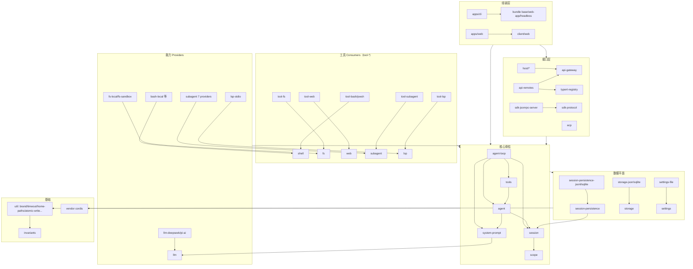

# 09 依赖关系

> 数据源：`docs/module-graph.md`（由 `scripts/gen-module-graph.ts` 从各包 `peerDependencies` 生成——**peerDependencies 是运行时依赖的权威信号**）。本文提炼规则与关键子图；完整 150+ 包逐包依赖表见源文件。

## 1. 依赖规则（约定，由门禁强制）

1. **扩展插件依赖 Service Definition，绝不依赖具体 Provider**：`dsh-agent-loop` 可整体替换；UI / hook / 工具插件只用 `dsh-agent`。组合 bundle（如 `dsh-agent-spine-demo`）才可以依赖脊柱插件。
2. **能力缝三角色可独立演化时才拆包**——这是 `fs/` 有 `fs`、`fs-local`、`tool-fs` 三个包的原因。
3. `@deepseek-ai/cordis` 是每个 harness 包的 peerDependency (+dev)。
4. 几乎所有包依赖 `runtime-diagnostics/invariants`（运行时不变量基建）；跨边界 id 依赖 `util/brand`。
5. 分层单向：apps/bundle → host/client/api → tool consumers → capability definitions → core → util/invariants → vendor cordis。**禁止反向**。
6. 工作区约束由 `pnpm run constraints`（check-workspace-constraints）沿 Project Reference 可达图校验。

## 2. 分层依赖图（简化）



## 3. 核心脊柱依赖表

| 包 | 依赖（去 `dsh-` 前缀） |
|---|---|
| `scope` | invariants |
| `session` | brand、invariants、llm、scope、typert-protocol |
| `system-prompt` | invariants、llm、scope |
| `agent` | invariants、llm、scope、session、system-prompt、typert-protocol |
| `tools` | agent、code-runtime、invariants、llm、scope、session、system-prompt、user-approval |
| `agent-loop` | agent、invariants、llm、scope、session、session-persistence、settings、system-prompt、tools |
| `agent-default-model` | agent、invariants、llm、settings |
| `agent-tool-presentation` | invariants、tools |
| `llm` | attachment、brand、invariants、timeout |
| `llm-deepseek` | anonymous-user-id、credentials、invariants、launch-environment、llm、settings、timeout |
| `llm-retry` | agent、brand、invariants、llm、session、timeout |
| `token-meter` | compaction、invariants、llm、session、session-projection |

## 4. 能力缝依赖示例（Definition / Provider / Consumer 三段式）

| 角色 | 包 | 关键依赖 |
|---|---|---|
| Definition | `fs` | brand、invariants、llm、sandbox |
| Provider | `fs-local` | fs |
| Provider | `fs-sandbox` | fs、fs-local、sandbox、sandbox-policy |
| Consumer | `tool-fs` | attachment、fs、llm、sandbox、sandbox-policy、session、system-prompt、tools、user-approval |
| Definition | `shell` | invariants、sandbox、settings、subprocess |
| Provider | `bash-local` / `pwsh-local` | settings、shell、subprocess、timeout |
| Consumer | `tool-bash` / `tool-pwsh` | agent、jobs、sandbox(-policy)、shell、shell-env、system-prompt、tools、user-approval |
| Definition | `subagent` | agent、agent-presets、brand、jobs、llm、sandbox(-policy)、scope、session(-persistence/-projection/-cache)、tools、user-approval |
| Provider | `subagent-fork-in-process` | agent、session、subagent、subagent-in-process-driver |
| Consumer | `tool-subagent` | agent、jobs、llm、subagent、system-prompt、tools |

规律：**Provider 只依赖 Definition（+基础件）；Consumer（tool-*）依赖 Definition + core 脊柱（tools/system-prompt/session）+ 审批（user-approval）**。

## 5. 接口层依赖要点

| 包 | 依赖要点 |
|---|---|
| `api-remotes` | 全仓最重依赖面：agent、agent-presets、api-gateway、commands、cordis-host-runner、credentials、goal、host-plugin-inventory、llm、message-feedback、session(-persistence)、settings、typert-registry |
| `api-gateway` | client-connection、typert-registry |
| `client-runtime` | api-remotes、typert-protocol、typert-registry |
| `client-ui-*` 插件 | api-remotes + client-runtime + client-ui-{primitives,slots}（+ client-locale i18n）；会话类再依赖 agent/tools/compaction 等 Host 侧类型 |
| `sdk-jsonrpc-server` | agent、llm、llm-deepseek、scope、sdk-protocol、session、subagent |
| `acp` | agent、attachment、llm、session、user-approval |
| `host-apiproxy` | agent-presets、cordis-host-runner |
| `web-app`（bundle） | shell-env、system-prompt（本体轻，靠 cordis.yml 引入其余） |
| `headless`（bundle） | agent、agent-default-model、llm、session |

## 6. 依赖方向速记

- `invariants` 是全图唯一零依赖包（根节点）。
- `util/*` 只依赖 invariants（brand 除外再加无）。
- core 六包内部：`scope → session → {system-prompt, agent} → tools → agent-loop`（箭头为"被依赖"方向）。
- `llm` 处于脊柱底层（session/system-prompt/agent 都依赖它的词汇表），provider 实现在其上。
- 持久化全部挂在 `session(-persistence)` 之下，不反向依赖循环。
- client 侧（浏览器聚合）只经 `api-remotes`/`typert-*` 触达 Host 类型，不直接 import Host 运行时。

## 7. 查看完整图

```sh
# 仓库内重新生成/校验
pnpm run gen-module-graph          # 生成 docs/module-graph.md
pnpm run verify-module-graph       # CI 新鲜度门禁
```
